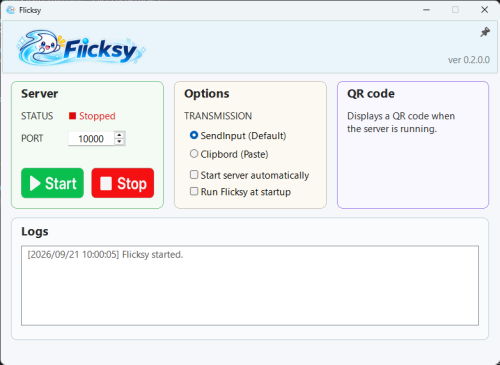
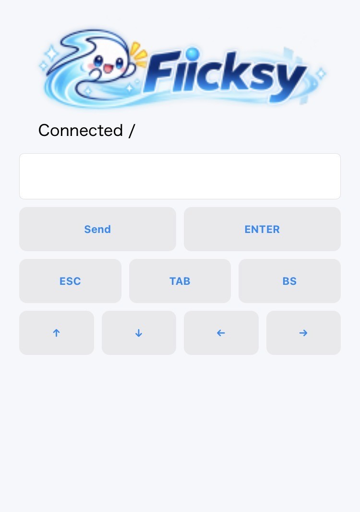

# Flicksy v0.4.6.1

### English

Flicksy lets you use your smartphone's flick input
to enter text on a Windows PC.

No dedicated mobile app is required.
Just connect through your web browser.

<p align="center">• • •</p>

### 日本語

Flicksy は、スマートフォンのフリック入力を
Windows PC の文字入力として利用するためのツールです。

スマホ側に専用アプリは不要で、
ブラウザから接続します。

### Server (Windows PC)


### Client (Smart Phone)



## Structure

```text
Smartphone
    ↓
Browser
    ↓
HTTP
    ↓
Flicksy
    ↓
SendInput / Clipboard
    ↓
Windows Application
```

## How to use

### English

1. Start `Flicksy.exe` on your Windows PC.
2. Click `START` to start the local server.
3. Make sure your smartphone and PC are connected to the **same network**.
4. Scan the QR code shown in Flicksy with your smartphone.
5. Open the displayed page in your browser.
6. Enter text on your smartphone and send it to the PC.
7. The text is entered into the currently active window on your PC.

**Note:** When `Start server automatically` is enabled, Flicksy starts in the system tray on the next launch without showing the main window.

<p align="center">• • •</p>

### 日本語

1. Windows PCで Flicksy.exe を起動します。
2. START を押してサーバーを開始します。
3. PCとスマートフォンを**同じネットワークに接続**します。
4. Flicksyに表示されたQRコードをスマートフォンで読み取ります。
5. ブラウザでFlicksyのページを開きます。
6. スマートフォンで文字を入力し、PCへ送信します。
7. 入力データはアクティブなウィンドウへ入力されます。

**Note:** 「Start server automatically」をチェックすると次回起動時にタスクトレイにのみ常駐し、メインウィンドウは表示されません

## Status

Currently under development.

### Security / セキュリティ

- Uses a temporary access token for client requests.
- The token is generated each time the server starts.
- Input and key requests require a valid token.

<p align="center">• • •</p>

- クライアント操作には一時アクセストークンを使用しています。
- トークンはサーバー起動ごとに生成されます。
- 文字入力やキー操作には有効なトークンが必要です。

## System Tray / タスクトレイ

Flicksy can remain active in the Windows system tray.

- Double-click the tray icon to restore the main window.
- Server status is shown in the tray tooltip.
- Notifications are displayed when the server starts, stops, or encounters an error.
- QR popup. Click the tray notification to quickly display the connection QR code.

<p align="center">• • •</p>

Flicksy はタスクトレイに常駐できます。

- トレイアイコンをダブルクリックするとメイン画面を表示します。
- ツールチップにサーバー状態を表示します。
- サーバーの開始、停止、エラー時に通知を表示します。
- メインウィンドウ非表示時、QRコードをポップアップさせるトレイメニューコマンドがあります。

## Change log

- Added Alt+Tab remote control with press-and-hold repeat behavior and safe Alt key release on timeout, server stop, and application exit.

## Roadmap

- Active-window screenshot preview
- Additional remote key controls
- Improved logging
- Better mobile UI

## Development

- C++17
- Win32 API
- Visual Studio 2022
- HTML / JavaScript

## Dependencies

- [cpp-httplib](https://github.com/yhirose/cpp-httplib) - MIT License
- [QR-Code-generator](https://github.com/nayuki/QR-Code-generator) - MIT License
- [toml++](https://github.com/marzer/tomlplusplus) - MIT License

All third-party libraries listed above are licensed under the MIT License.
See `THIRD_PARTY_LICENSES.txt` for details.

Visual Studio 2022 project files are included.

## License

This project is licensed under the MIT License.
